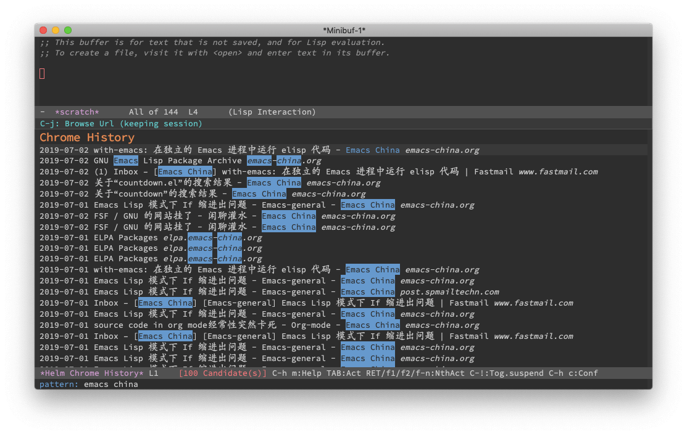

# helm-chrome-history

Browse your Chrome history with Helm.

## Requirements

- Emacs >= 25.1
- `sqlite3` in your PATH

## Usage

### `M-x helm-chrome-history`

Brwose Chrome History with helm.

### `M-x helm-chrome-history-clear-cache`

Clear `helm-chrome-history` cache.

## Customization

### `helm-chrome-history-file`

Your Chrome History SQLite database file.

### `helm-chrome-history-sql`

The SQL used to extract history.
